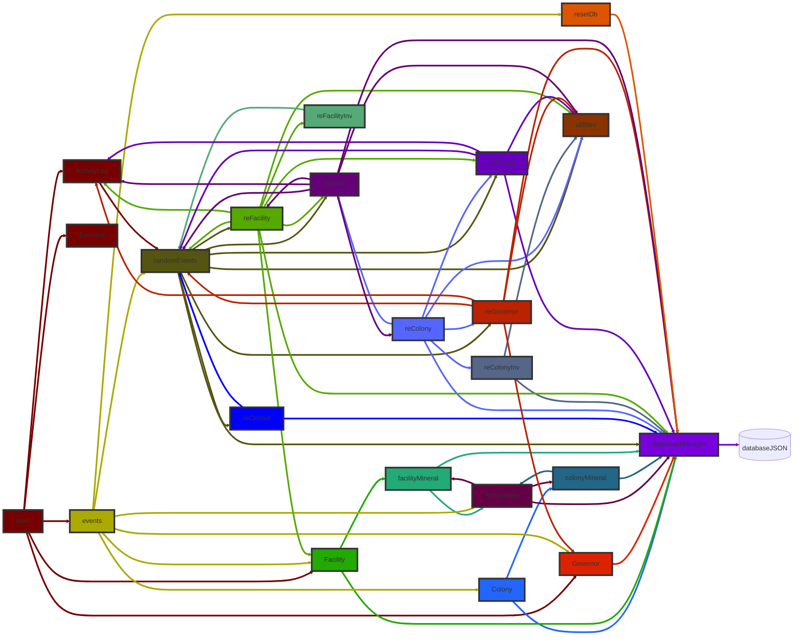

```mermaid
graph LR;
  main-->ActivityLog;
  main-->Exomine;
  main-->Facility;
  main-->Governor;
  main-->events;
  databaseManager-->db[(databaseJSON)]
  Colony-->databaseManager
  Colony-->colonyMineral
  Facility-->databaseManager
  Facility-->facilityMineral
  Governor-->databaseManager
  Transaction-->databaseManager
  Transaction-->facilityMineral
  Transaction-->colonyMineral
  colonyMineral-->databaseManager
  colonyMineral-->Transaction
  facilityMineral-->databaseManager
  facilityMineral-->Transaction
  events-->Colony
  events-->Facility
  events-->resetDb
  events-->Transaction
  events-->randomEvents
  events-->Governor  
  randomEvents-->databaseManager
  randomEvents-->reForces
  randomEvents-->reFacility
  randomEvents-->reGovernor
  randomEvents-->reCensus
  randomEvents-->rePirate
  randomEvents-->utilities
  reCensus-->databaseManager
  reCensus-->randomEvents
  reColony-->databaseManager
  reColony-->reForces
  reColony-->reGovernor
  reColony-->rePirate
  reColony-->reColonyInv
  reColony-->utilities
  reColonyInv-->databaseManager
  reColonyInv-->utilities
  reFacility-->databaseManager
  reFacility-->randomEvents
  reFacility-->utilities
  reFacility-->Facility
  reFacility-->ActivityLog
  reFacility-->reForces
  reFacility-->rePirate
  reFacility-->reFacilityInv
  reFacilityInv-->randomEvents
  reForces-->databaseManager
  reForces-->randomEvents
  reForces-->ActivityLog
  reForces-->utilities
  reGovernor-->databaseManager
  reGovernor-->randomEvents
  reGovernor-->utilities
  reGovernor-->ActivityLog
  reGovernor-->Governor
  rePirate-->databaseManager
  rePirate-->randomEvents
  rePirate-->ActivityLog
  rePirate-->reFacility
  rePirate-->reColony
  rePirate-->utilities
  ActivityLog-->randomEvents
  resetDb-->databaseManager

  style Exomine fill:#700,stroke:#333,stroke-width:4px
  style main fill:#700,stroke:#333,stroke-width:4px
  style databaseManager fill:#70d,stroke:#333,stroke-width:4px
  style Colony fill:#26f,stroke:#333,stroke-width:4px
  style Facility fill:#2a0,stroke:#333,stroke-width:4px
  style Governor fill:#d20,stroke:#333,stroke-width:4px
  style Transaction fill:#604,stroke:#333,stroke-width:4px
  style colonyMineral fill:#268,stroke:#333,stroke-width:4px
  style facilityMineral fill:#2a7,stroke:#333,stroke-width:4px
  style events fill:#aa0,stroke:#333,stroke-width:4px
  style randomEvents fill:#551,stroke:#333,stroke-width:4px
  style reCensus fill:#00f,stroke:#333,stroke-width:4px
  style reColony fill:#56f,stroke:#333,stroke-width:4px
  style reColonyInv fill:#568,stroke:#333,stroke-width:4px
  style reFacility fill:#5a0,stroke:#333,stroke-width:4px
  style reFacilityInv fill:#5a7,stroke:#333,stroke-width:4px
  style reForces fill:#60b,stroke:#333,stroke-width:4px
  style reGovernor fill:#b20,stroke:#333,stroke-width:4px
  style rePirate fill:#607,stroke:#333,stroke-width:4px
  style ActivityLog fill:#700,stroke:#333,stroke-width:4px
  style resetDb fill:#d50,stroke:#333,stroke-width:4px
  style utilities fill:#830,stroke:#333,stroke-width:4px

  linkStyle 0 stroke:#700,stroke-width:4px
  linkStyle 1 stroke:#700,stroke-width:4px
  linkStyle 2 stroke:#700,stroke-width:4px
  linkStyle 3 stroke:#700,stroke-width:4px
  linkStyle 4 stroke:#700,stroke-width:4px
  linkStyle 5 stroke:#70d,stroke-width:4px
  linkStyle 6 stroke:#26f,stroke-width:4px
  linkStyle 7 stroke:#26f,stroke-width:4px
  linkStyle 8 stroke:#2a0,stroke-width:4px
  linkStyle 9 stroke:#2a0,stroke-width:4px
  linkStyle 10 stroke:#d20,stroke-width:4px
  linkStyle 11 stroke:#604,stroke-width:4px
  linkStyle 12 stroke:#604,stroke-width:4px
  linkStyle 13 stroke:#604,stroke-width:4px
  linkStyle 14 stroke:#268,stroke-width:4px
  linkStyle 15 stroke:#268,stroke-width:4px
  linkStyle 16 stroke:#2a7,stroke-width:4px
  linkStyle 17 stroke:#2a7,stroke-width:4px
  linkStyle 18 stroke:#aa0,stroke-width:4px
  linkStyle 19 stroke:#aa0,stroke-width:4px
  linkStyle 20 stroke:#aa0,stroke-width:4px
  linkStyle 21 stroke:#aa0,stroke-width:4px
  linkStyle 22 stroke:#aa0,stroke-width:4px
  linkStyle 23 stroke:#aa0,stroke-width:4px
  linkStyle 24 stroke:#551,stroke-width:4px
  linkStyle 25 stroke:#551,stroke-width:4px
  linkStyle 26 stroke:#551,stroke-width:4px
  linkStyle 27 stroke:#551,stroke-width:4px
  linkStyle 28 stroke:#551,stroke-width:4px
  linkStyle 29 stroke:#551,stroke-width:4px
  linkStyle 30 stroke:#551,stroke-width:4px
  linkStyle 31 stroke:#00f,stroke-width:4px
  linkStyle 32 stroke:#00f,stroke-width:4px
  linkStyle 33 stroke:#56f,stroke-width:4px
  linkStyle 34 stroke:#56f,stroke-width:4px
  linkStyle 35 stroke:#56f,stroke-width:4px
  linkStyle 36 stroke:#56f,stroke-width:4px
  linkStyle 37 stroke:#56f,stroke-width:4px
  linkStyle 38 stroke:#56f,stroke-width:4px
  linkStyle 39 stroke:#568,stroke-width:4px
  linkStyle 40 stroke:#568,stroke-width:4px
  linkStyle 41 stroke:#5a0,stroke-width:4px
  linkStyle 42 stroke:#5a0,stroke-width:4px
  linkStyle 43 stroke:#5a0,stroke-width:4px
  linkStyle 44 stroke:#5a0,stroke-width:4px
  linkStyle 45 stroke:#5a0,stroke-width:4px
  linkStyle 46 stroke:#5a0,stroke-width:4px
  linkStyle 47 stroke:#5a0,stroke-width:4px
  linkStyle 48 stroke:#5a0,stroke-width:4px
  linkStyle 49 stroke:#5a7,stroke-width:4px
  linkStyle 50 stroke:#60b,stroke-width:4px
  linkStyle 51 stroke:#60b,stroke-width:4px
  linkStyle 52 stroke:#60b,stroke-width:4px
  linkStyle 53 stroke:#60b,stroke-width:4px
  linkStyle 54 stroke:#b20,stroke-width:4px
  linkStyle 55 stroke:#b20,stroke-width:4px
  linkStyle 56 stroke:#b20,stroke-width:4px
  linkStyle 57 stroke:#b20,stroke-width:4px
  linkStyle 58 stroke:#b20,stroke-width:4px
  linkStyle 59 stroke:#607,stroke-width:4px
  linkStyle 60 stroke:#607,stroke-width:4px
  linkStyle 61 stroke:#607,stroke-width:4px
  linkStyle 62 stroke:#607,stroke-width:4px
  linkStyle 63 stroke:#607,stroke-width:4px
  linkStyle 64 stroke:#607,stroke-width:4px
  linkStyle 65 stroke:#700,stroke-width:4px
  linkStyle 66 stroke:#d50,stroke-width:4px

```