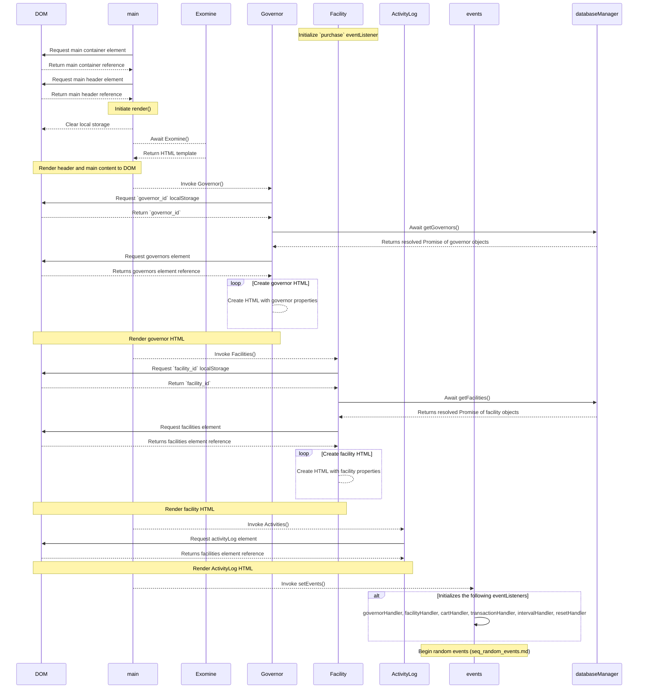

```mermaid
sequenceDiagram
  participant DOM
  participant main
  participant Exomine
  participant Governor
  participant Facility
  participant ActivityLog
  participant events
  participant databaseManager
  Note over Facility: Initialize `purchase` eventListener
  main->>DOM: Request main container element
  DOM-->>main: Return main container reference
  main->>DOM: Request main header element
  DOM-->>main: Return main header reference
  Note over main: Initiate render()
  main-->>DOM: Clear local storage
  main-->Exomine: Await Exomine()
  Exomine-->>main: Return HTML template
  Note over main,DOM: Render header and main content to DOM
  main-->>Governor: Invoke Governor()
  Governor->>DOM: Request `governor_id` localStorage 
  DOM-->>Governor: Return `governor_id`
  Governor->>databaseManager: Await getGovernors()
  databaseManager-->>Governor: Returns resolved Promise of governor objects
  Governor->>DOM: Request governors element
  DOM-->>Governor: Returns governors element reference
  loop Create governor HTML
    Governor-->Governor: Create HTML with governor properties
  end
  Note over Governor,DOM: Render governor HTML
  main-->>Facility: Invoke Facilities()
  Facility->>DOM: Request `facility_id` localStorage 
  DOM-->>Facility: Return `facility_id`
  Facility->>databaseManager: Await getFacilities()
  databaseManager-->>Facility: Returns resolved Promise of facility objects
  Facility->>DOM: Request facilities element
  DOM-->>Facility: Returns facilities element reference
  loop Create facility HTML
    Facility-->Facility: Create HTML with facility properties
  end
  Note over Facility,DOM: Render facility HTML
  main-->>ActivityLog: Invoke Activities()
  ActivityLog->>DOM: Request activityLog element
  DOM-->>ActivityLog: Returns facilities element reference
  Note over ActivityLog,DOM: Render ActivityLog HTML
  main-->>events: Invoke setEvents()
  alt Initializes the following eventListeners
    events->>events: governorHandler, facilityHandler, cartHandler, transactionHandler, intervalHandler,    resetHandler
  end
  Note over events: Begin random events (seq_random_events.md)
```