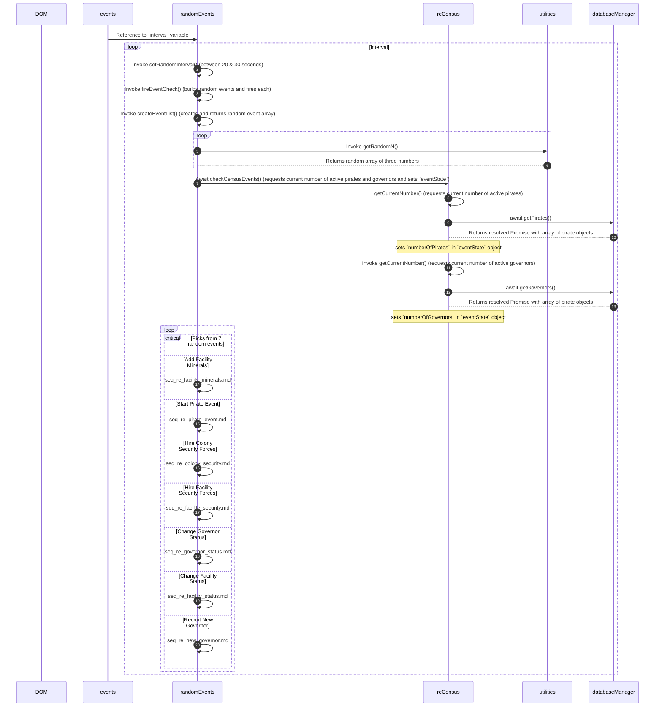

```mermaid 
sequenceDiagram
  participant DOM
  participant events
  participant randomEvents
  participant reCensus
  participant utilities
  participant databaseManager
  events->>randomEvents: Reference to `interval` variable
  loop interval
    autonumber
    randomEvents->>randomEvents: Invoke setRandomInterval()  (between 20 & 30 seconds)
    randomEvents->>randomEvents: Invoke fireEventCheck() (builds random events and fires each)
    randomEvents->>randomEvents: Invoke createEventList() (creates and returns random event array)
    loop
      randomEvents->>utilities: Invoke getRandomN()
      utilities-->randomEvents: Returns random array of three numbers
    end
    randomEvents->>reCensus: Await checkCensusEvents() (requests current number of active pirates and governors and sets `eventState`)
    reCensus->>reCensus: getCurrentNumber() (requests current number of active pirates)
    reCensus->>databaseManager: await getPirates()
    databaseManager-->reCensus: Returns resolved Promise with array of pirate objects
    note over reCensus: sets `numberOfPirates` in `eventState` object
    reCensus->>reCensus: Invoke getCurrentNumber() (requests current number of active governors)
    reCensus->>databaseManager: await getGovernors()
    databaseManager-->reCensus: Returns resolved Promise with array of pirate objects
    note over reCensus: sets `numberOfGovernors` in `eventState` object
    loop
      critical Picks from 7 random events
        option Add Facility Minerals
        randomEvents->>randomEvents: seq_re_facility_minerals.md
        option Start Pirate Event
        randomEvents->>randomEvents: seq_re_pirate_event.md
        option Hire Colony Security Forces
        randomEvents->>randomEvents: seq_re_colony_security.md
        option Hire Facility Security Forces
        randomEvents->>randomEvents: seq_re_facility_security.md
        option Change Governor Status
        randomEvents->>randomEvents: seq_re_governor_status.md
        option Change Facility Status
        randomEvents->>randomEvents: seq_re_facility_status.md
        option Recruit New Governor
        randomEvents->>randomEvents: seq_re_new_governor.md
      end
    end
  end
```