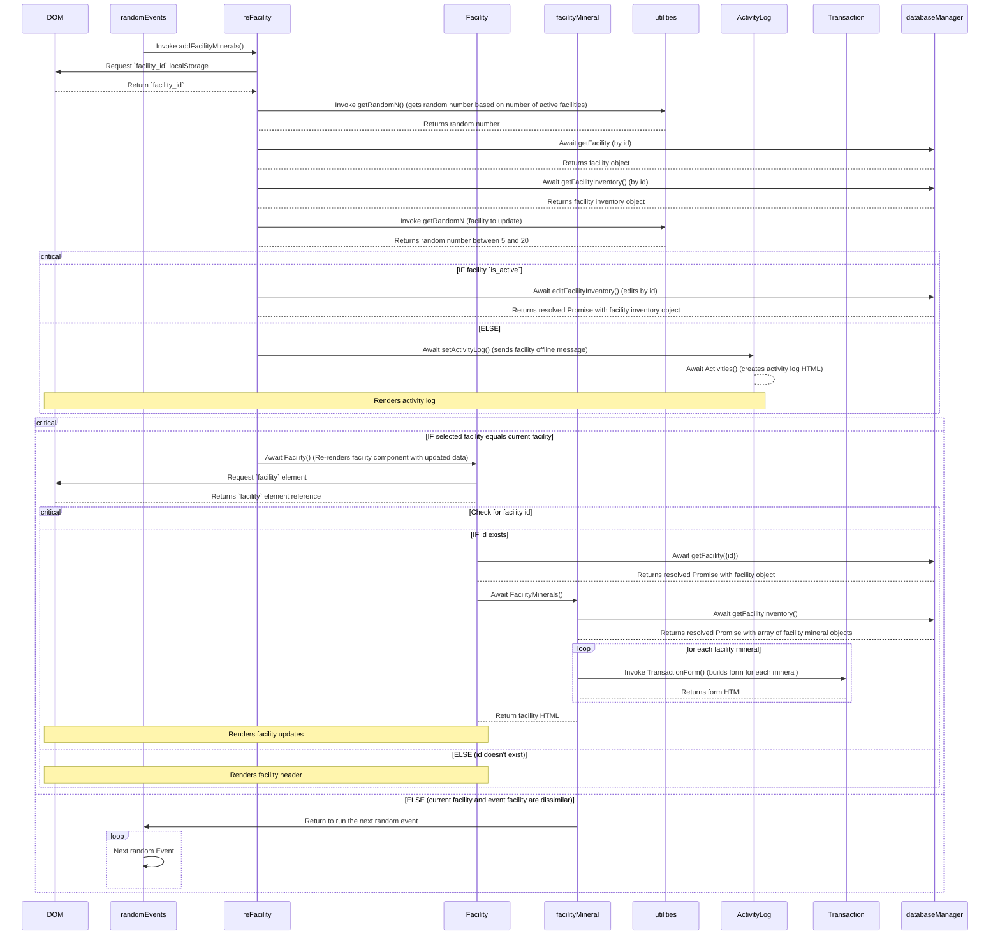

```mermaid
sequenceDiagram
  participant DOM
  participant randomEvents
  participant reFacility
  participant Facility
  participant facilityMineral
  participant utilities
  participant ActivityLog
  participant Transaction
  participant databaseManager

  randomEvents->>reFacility: Invoke addFacilityMinerals()
  reFacility->>DOM: Request `facility_id` localStorage 
  DOM-->>reFacility: Return `facility_id`
  reFacility->>utilities: Invoke getRandomN() (gets random number based on number of active facilities)
  utilities-->reFacility: Returns random number
  reFacility->>databaseManager: Await getFacility (by id)
  databaseManager-->reFacility: Returns facility object
  reFacility->>databaseManager: Await getFacilityInventory() (by id)
  databaseManager-->reFacility: Returns facility inventory object
  reFacility->>utilities: Invoke getRandomN (facility to update)
  utilities-->reFacility: Returns random number between 5 and 20
    critical
      option IF facility `is_active`
        reFacility->>databaseManager: Await editFacilityInventory() (edits by id)
        databaseManager-->reFacility: Returns resolved Promise with facility inventory object
      option ELSE
        reFacility->>ActivityLog: Await setActivityLog() (sends facility offline message)
        ActivityLog-->ActivityLog: Await Activities() (creates activity log HTML)
        note over ActivityLog,DOM: Renders activity log
    end
    critical
      option IF selected facility equals current facility
        reFacility->>Facility: Await Facility() (Re-renders facility component with updated data)
        Facility->>DOM: Request `facility` element
        DOM-->Facility: Returns `facility` element reference
        critical Check for facility id
          option IF id exists
            Facility->>databaseManager: Await getFacility({id})
            databaseManager-->Facility: Returns resolved Promise with facility object
            Facility->>facilityMineral: Await FacilityMinerals()
            facilityMineral->>databaseManager: Await getFacilityInventory()
            databaseManager-->facilityMineral: Returns resolved Promise with array of facility mineral objects
            loop for each facility mineral
              facilityMineral->>Transaction: Invoke TransactionForm() (builds form for each mineral)
              Transaction-->facilityMineral: Returns form HTML  
            end
            facilityMineral-->Facility: Return facility HTML
            note over Facility,DOM: Renders facility updates
          option ELSE (id doesn't exist)
            note over Facility,DOM: Renders facility header
        end
      option ELSE (current facility and event facility are dissimilar)
        facilityMineral->>randomEvents: Return to run the next random event
        loop
          randomEvents->>randomEvents: Next random Event
        end
    end

```